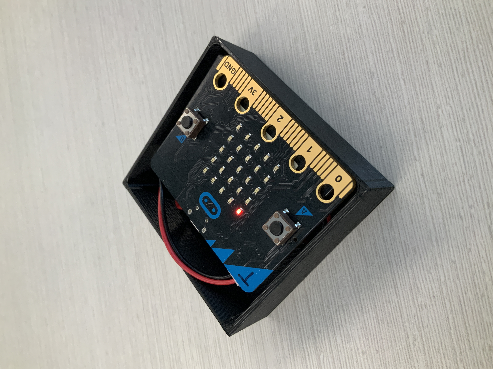

# Mission-to-Mars-Documentation




# Recieve Code

```python
radio.set_group(69)


def on_received_value(name, value):

   serial.write_value(name, value)

radio.on_received_value(on_received_value)
```

# Send Code

```python
radio.set_group(69)


def on_forever():
 
   Y = input.acceleration(Dimension.Y)

   X = input.acceleration(Dimension.X)

   Z = input.acceleration(Dimension.Z)

   radio.send_value("y", Y)

   radio.send_value("x", X)

   radio.send_value("z", Z)

   led.toggle(0, 0)
   
basic.forever(on_forever)
```
 
